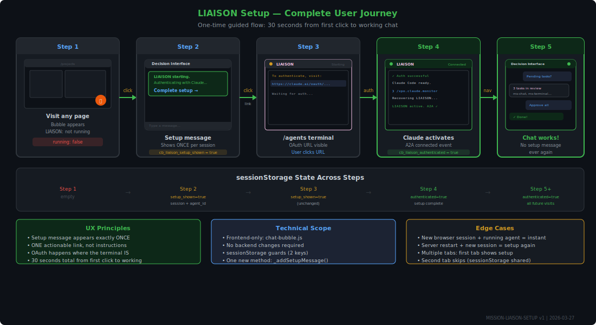
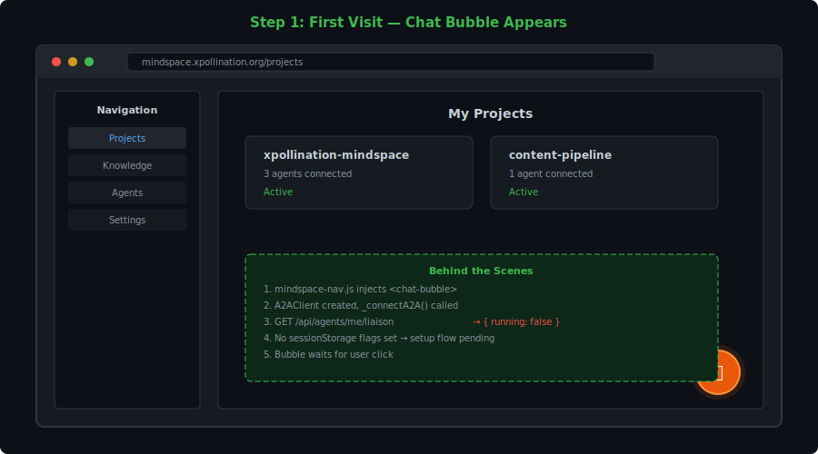
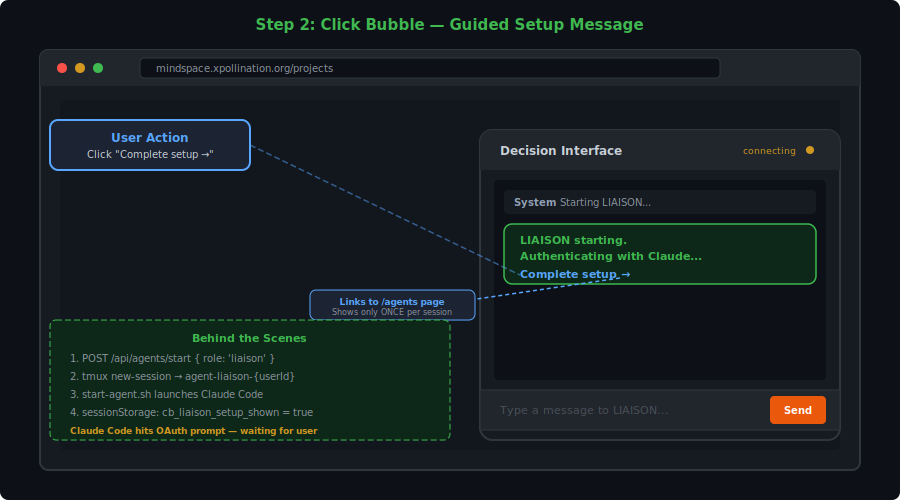
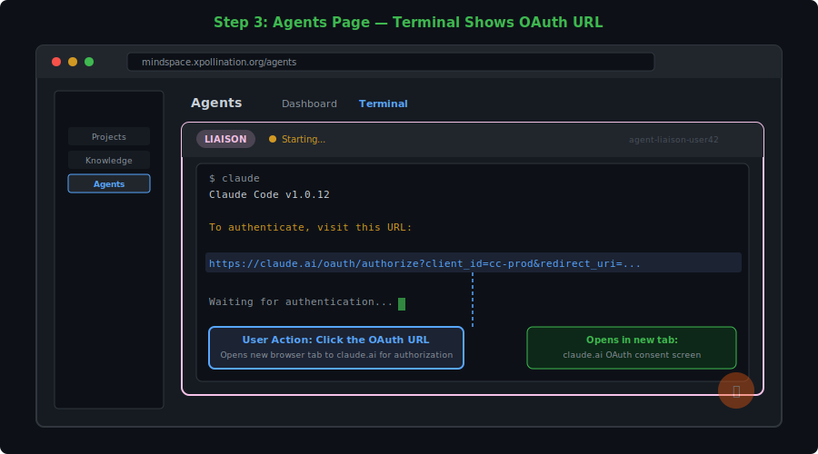
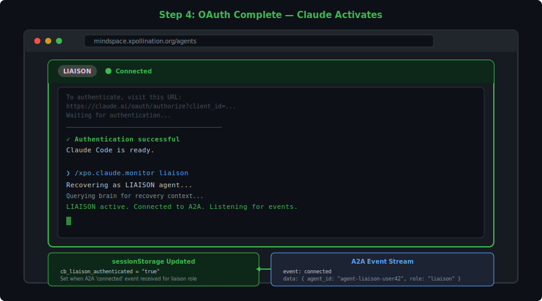
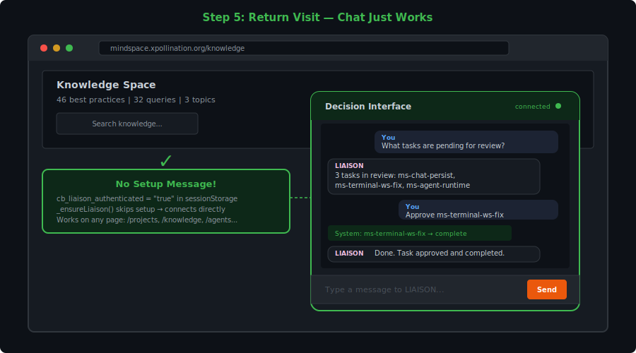

# MISSION-LIAISON-SETUP: First-Time LIAISON Agent Setup UX

**Status:** Active | **Project:** xpollination-mindspace | **Created:** 2026-03-27 | **Version:** 1

## Vision

A new user opens Mindspace for the first time. They click the chat bubble. Behind the scenes, a personal LIAISON agent spins up — but Claude Code needs a one-time OAuth authorization. The user should experience this as a **single, guided, 30-second setup** — not a recurring nag. One link. One click. Done forever.

## Problem Statement

The current `_ensureLiaison()` in `chat-bubble.js` has three UX defects:

1. **No sessionStorage guard** — the "Starting LIAISON..." message fires on **every page load** when LIAISON isn't yet authenticated, not just once
2. **No actionable link** — the message says "Open Agents page to complete setup" as plain text, not a clickable link to `/agents`
3. **No completion detection** — there's no `cb_liaison_authenticated` flag to suppress the setup flow after OAuth succeeds

The result: users see a repetitive, non-actionable setup prompt that doesn't guide them through the OAuth step.

## User Journey



### Step 1: First Visit — Chat Bubble Appears



User visits any authenticated Mindspace page (e.g. `/projects`, `/knowledge`, `/`). The `<chat-bubble>` component loads in the bottom-right corner. The orange circle with 💬 is visible but unobtrusive.

**What happens behind the scenes:**
- `mindspace-nav.js` injects `<chat-bubble>` on every page except `/login` and `/register`
- `connectedCallback()` creates an `A2AClient` and calls `_connectA2A()`
- `_ensureLiaison()` fires — calls `GET /api/agents/me/liaison`
- Response: `{ running: false }` — no tmux session exists yet

**No action taken yet.** The bubble waits for the user to click.

### Step 2: Click Bubble — Guided Setup Message



User clicks the chat bubble. The panel expands. Because LIAISON isn't running, the chat shows a **one-time setup message**:

```
System: LIAISON starting. Authenticating with Claude...
        Complete setup → [link to /agents]
```

**Key UX decisions:**
- The "Complete setup →" text is a **clickable link** that navigates to `/agents`
- This message only appears **once per browser session** — guarded by `sessionStorage`
- If `sessionStorage.getItem('cb_liaison_setup_shown')` is already set, this message is suppressed
- After showing, immediately sets `sessionStorage.setItem('cb_liaison_setup_shown', 'true')`

**What happens behind the scenes:**
- `POST /api/agents/start { role: 'liaison' }` creates a tmux session: `agent-liaison-{userId}`
- The tmux session runs `start-agent.sh liaison {userId}` which launches Claude Code
- Claude Code starts its boot sequence and immediately hits the OAuth prompt
- Response: `{ sessionName, agentId, status: 'starting' }`

### Step 3: Agents Page — Terminal Shows OAuth



User clicks the "Complete setup →" link and arrives at `/agents`. The agent grid shows their LIAISON agent card with a **terminal view**. Inside the terminal (xterm.js via WebSocket), Claude Code's OAuth prompt is visible:

```
To authenticate, visit this URL:
https://claude.ai/oauth/authorize?client_id=...&redirect_uri=...

Waiting for authentication...
```

**Key UX decisions:**
- The terminal renders the full OAuth URL as clickable (xterm.js link detection)
- The agent card shows status: "Starting..." with a yellow dot
- The user clicks the OAuth URL — it opens a new browser tab to `claude.ai`

**What happens behind the scenes:**
- `agent-terminal.js` connects via WebSocket to `/ws/terminal/{sessionName}`
- The terminal streams Claude Code's stdout in real-time
- Claude Code is waiting for OAuth callback

### Step 4: OAuth Authorization — Claude Activates



In the new browser tab, the user sees Claude's OAuth consent screen. They click "Authorize". The tab can be closed. Back on the `/agents` page, the terminal shows Claude Code activating:

```
✓ Authentication successful
Claude Code is ready.

> /xpo.claude.monitor liaison
Recovering as LIAISON agent...
```

**Key UX decisions:**
- Claude Code auto-runs the monitor startup command (pre-configured in `start-agent.sh`)
- The agent card status changes: yellow dot → green dot, "Starting..." → "Connected"
- `sessionStorage.setItem('cb_liaison_authenticated', 'true')` is set when the agent's A2A connection succeeds (detected via SSE event)

**What happens behind the scenes:**
- Claude Code receives the OAuth token and activates
- `start-agent.sh` has a pre-configured initial prompt: `/xpo.claude.monitor liaison`
- LIAISON agent recovers from brain, connects to A2A server
- A2A server emits a `connected` event for this agent
- The chat bubble's A2A client receives the event and sets the sessionStorage flag

### Step 5: Return to Any Page — Chat Works



User navigates back to any Mindspace page (or refreshes). The chat bubble loads again. This time:

- `_ensureLiaison()` checks `sessionStorage.getItem('cb_liaison_authenticated')` → `'true'`
- **Skips the entire setup flow**
- `GET /api/agents/me/liaison` returns `{ running: true }`
- Chat bubble connects to LIAISON via A2A
- User can type messages and get responses

**The setup message never appears again** for this browser session.

### Step 6: Subsequent Sessions

When the user opens a new browser session (sessionStorage cleared):
- `cb_liaison_authenticated` is gone
- `_ensureLiaison()` fires again
- But `GET /api/agents/me/liaison` returns `{ running: true }` (tmux session persists across browser sessions)
- **No setup needed** — the agent is already running and authenticated
- Sets `cb_liaison_authenticated = true` immediately
- Chat works instantly

Only if the tmux session has been killed (server restart, explicit cleanup) will the user see the setup flow again.

## Technical Changes

### File: `viz/versions/v0.0.38/js/chat-bubble.js`

**`_ensureLiaison()` method rewrite:**

```javascript
async _ensureLiaison() {
  // Guard: already authenticated this session
  if (sessionStorage.getItem('cb_liaison_authenticated') === 'true') {
    // Still fetch session info for routing
    try {
      const res = await fetch('/api/agents/me/liaison');
      const data = await res.json();
      if (data.running) {
        sessionStorage.setItem('cb_liaison_session', data.sessionName);
        sessionStorage.setItem('cb_liaison_agent_id', data.agentId || data.sessionName);
      }
    } catch { /* best-effort */ }
    return;
  }

  try {
    const res = await fetch('/api/agents/me/liaison');
    const data = await res.json();

    if (data.running) {
      // Already running — mark authenticated, no setup needed
      sessionStorage.setItem('cb_liaison_session', data.sessionName);
      sessionStorage.setItem('cb_liaison_agent_id', data.agentId || data.sessionName);
      sessionStorage.setItem('cb_liaison_authenticated', 'true');
      return;
    }

    // Not running — auto-start, show ONE setup message
    if (sessionStorage.getItem('cb_liaison_setup_shown')) return; // already shown this session

    const start = await fetch('/api/agents/start', {
      method: 'POST',
      headers: { 'Content-Type': 'application/json' },
      body: JSON.stringify({ role: 'liaison' }),
    });
    const agent = await start.json();

    if (start.ok) {
      sessionStorage.setItem('cb_liaison_session', agent.sessionName);
      sessionStorage.setItem('cb_liaison_agent_id', agent.agentId || agent.sessionName);
      sessionStorage.setItem('cb_liaison_setup_shown', 'true');

      // Render setup message with clickable link
      this._addSetupMessage(agent.status);
    }
  } catch { /* best-effort */ }
}
```

**New `_addSetupMessage()` method:**

```javascript
_addSetupMessage(status) {
  const div = document.createElement('div');
  div.style.cssText = `padding:8px;font-size:12px;background:#f0fdf4;border:1px solid #86efac;border-radius:8px;margin:4px 0;`;
  div.innerHTML = `
    <div style="color:#166534;font-weight:600;margin-bottom:4px;">
      LIAISON ${status === 'starting' ? 'starting' : 'ready'}. Authenticating with Claude...
    </div>
    <a href="/agents" style="color:#2563eb;font-weight:600;text-decoration:none;">
      Complete setup →
    </a>
  `;
  this._messagesEl.appendChild(div);
  this._messagesEl.scrollTop = this._messagesEl.scrollHeight;
}
```

**A2A `connected` event handler (in `_connectA2A`):**

```javascript
this._client.on('connected', (data) => {
  if (data.role === 'liaison') {
    sessionStorage.setItem('cb_liaison_authenticated', 'true');
  }
});
```

### SessionStorage Keys (Complete)

| Key | Set When | Read When | Purpose |
|-----|----------|-----------|---------|
| `cb_liaison_authenticated` | LIAISON's A2A connection succeeds OR agent already running | Every `_ensureLiaison()` call | Skip entire setup flow |
| `cb_liaison_setup_shown` | Setup message rendered | Before showing setup message | Prevent duplicate setup messages |
| `cb_liaison_session` | Agent start response | Message routing | tmux session name for LIAISON |
| `cb_liaison_agent_id` | Agent start response | `_sendHumanInput()` | Target agent for HUMAN_INPUT messages |
| `cb_messages` | Every `_addMessage()` | Page load restore | Persist chat across navigation |

### No Backend Changes Required

The existing endpoints are sufficient:
- `GET /api/agents/me/liaison` — already checks tmux session
- `POST /api/agents/start` — already creates tmux session + starts Claude Code
- A2A SSE stream — already emits `connected` events

This is a **frontend-only fix** in `chat-bubble.js`.

## Acceptance Criteria

1. **First click shows setup once** — clicking the chat bubble when LIAISON is not running shows the setup message with "Complete setup →" link exactly once
2. **Link navigates to /agents** — the "Complete setup →" link goes to `/agents` where the terminal is visible
3. **OAuth flow works** — user can see and click the OAuth URL in the terminal
4. **Flag prevents repeat** — after LIAISON connects via A2A, `cb_liaison_authenticated` is set and the setup message never appears again in this session
5. **Already running = instant** — if LIAISON tmux session already exists (e.g. new tab), no setup message at all
6. **Survives navigation** — navigating between pages doesn't re-trigger the setup flow
7. **Clean session = fresh start** — new browser session with dead LIAISON shows setup flow again (correct behavior)

## Scope

**In scope:**
- `chat-bubble.js` — sessionStorage guards + setup message with link
- SVG journey diagrams for documentation

**Out of scope:**
- Backend changes (none needed)
- Auto-detecting OAuth completion from the terminal (future enhancement)
- Multi-agent setup (only LIAISON uses this flow)
- Persistent storage (sessionStorage is correct — setup should re-check on new sessions)
