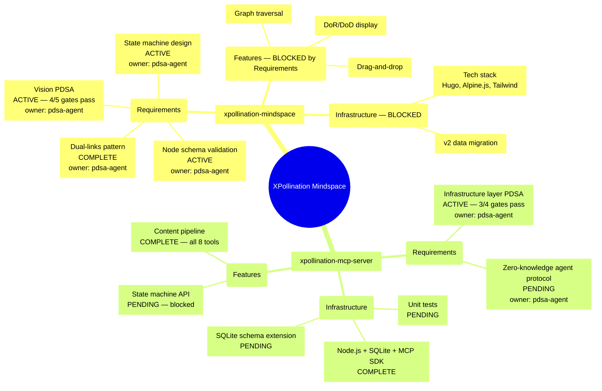
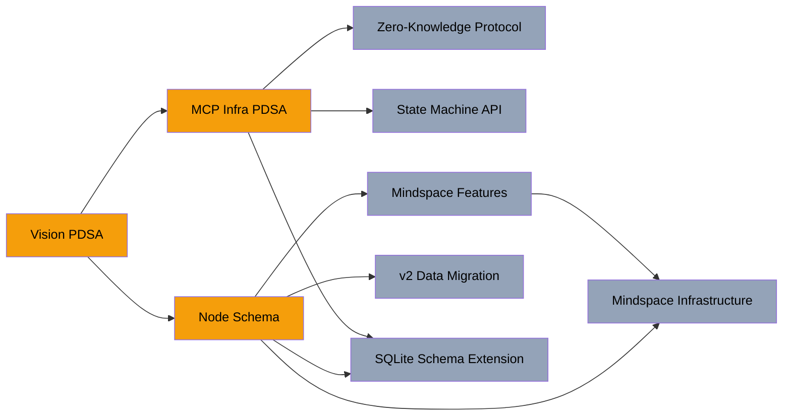

# Mindspace Overview — Visual Map

> Auto-generated from `mindspace-simulation.yaml`. This renders as a visual diagram on GitHub.

## The Mindmap Tree



## Status Legend

| Status | Meaning | Count |
|--------|---------|-------|
| COMPLETE | All quality gates pass, outputs delivered | 4 |
| ACTIVE | Work in progress, some gates pass | 4 |
| PENDING | Not yet started or blocked by dependencies | 10 |

## Current Focus (Scope Stack)

```
root → mindspace → Requirements → Vision PDSA ← YOU ARE HERE
```

## Dependency Flow



**Legend:** Amber = active work | Gray = blocked/pending

## Node Detail: What Each Active Node Needs

### Vision PDSA (ms-vision)
- **What:** Synthesize Thomas's mindmap metaphor with v3 recursive tree design
- **DoR:** Thomas's vision input captured -- READY
- **DoD:** Thomas approves vision -- 4/5 gates PASS, awaiting Thomas approval
- **Output:** `docs/pdsa/2026-02-02-UTC-1300.mindspace-vision.pdsa.md`

### Node Schema (ms-node-schema)
- **What:** Validate the draft schema from Vision PDSA Section 4.1 by using it in the mockup
- **DoR:** Vision PDSA draft schema -- READY
- **DoD:** Schema represents all nodes with full DoR/DoD. Thomas confirms.
- **Output:** Validated schema or schema revision

### State Machine Design (ms-state-machine)
- **What:** Walk through the state machine with the mockup's nodes, verify transitions
- **DoR:** MCP Infrastructure PDSA Section 4 -- READY
- **DoD:** State machine handles all node lifecycle scenarios
- **Output:** Validated state machine or revision

### MCP Infrastructure Layer PDSA (mcp-infra-pdsa)
- **What:** Define MCP server's new role: API surface, state machine, data model
- **DoR:** Vision PDSA three-actor model -- READY
- **DoD:** Full API surface, state machine lifecycle, SQLite schema -- 3/4 gates PASS, awaiting Thomas approval
- **Output:** `xpollination-mcp-server/docs/pdsa/2026-02-02-UTC-1500.mcp-server-infrastructure-layer.pdsa.md`

## Agents

| Agent | Color | Active Nodes |
|-------|-------|-------------|
| Thomas | amber | Approval gates on Vision + MCP Infra |
| Orchestrator | indigo | mindspace, mcp-server (coordination) |
| PDSA | violet | Vision, Schema, State Machine, MCP Infra, Zero-Knowledge |
| Dev | emerald | Standing by (features/infra blocked by requirements) |
