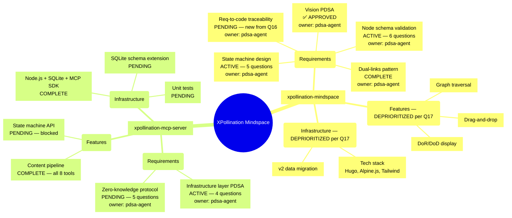
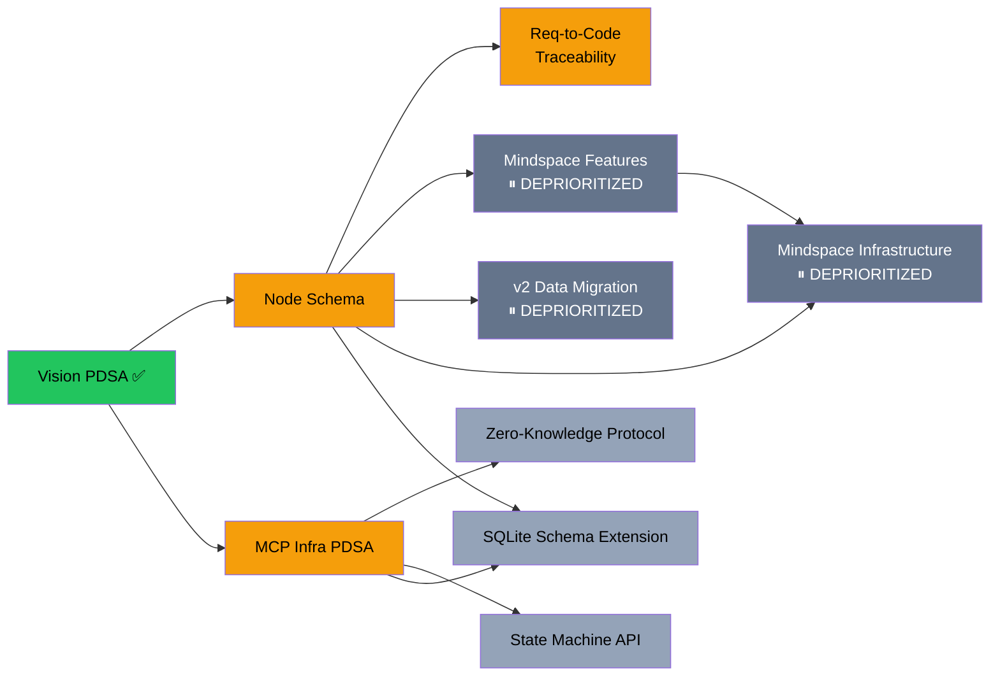
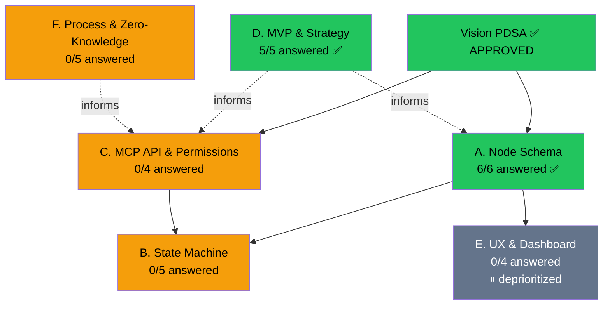

# Mindspace Overview — Visual Map

> Auto-generated from `mindspace-simulation.yaml`. This renders as a visual diagram on GitHub.

## The Mindmap Tree



## Status Legend

| Status | Meaning | Count |
|--------|---------|-------|
| APPROVED | Thomas approved, all quality gates pass | 1 |
| COMPLETE | All quality gates pass, outputs delivered | 4 |
| ACTIVE | Work in progress, questions open | 4 |
| PENDING | Not yet started or blocked by dependencies | 6 |
| DEPRIORITIZED | Documented for future, not on the critical path (per Q17) | 5 |

## Current Focus (Scope Stack)

```
root → Grammar Phase — 18 questions remaining (11 answered, Area A+D complete)
```

**Phase:** Trivium Grammar — gathering facts, identifying gaps, asking the right questions before building.
**MVP decision (Q16):** MCP state machine only. No dashboard. Enforcement first.

## Dependency Flow (click nodes to open specs)



**Legend:** Green = approved | Amber = active | Light gray = pending | Dark gray = deprioritized
**Tip:** Click any node to open the PDSA document that specifies it.

## PDSA Quick Links

| Node | Spec Location | GitHub Link |
|------|--------------|-------------|
| Vision PDSA | Vision PDSA (full document) | [mindspace-vision.pdsa.md](https://github.com/PichlerThomas/xpollination-mindspace/blob/main/docs/pdsa/2026-02-02-UTC-1300.mindspace-vision.pdsa.md) |
| Node Schema | Vision PDSA Section 4.1 | [mindspace-vision.pdsa.md](https://github.com/PichlerThomas/xpollination-mindspace/blob/main/docs/pdsa/2026-02-02-UTC-1300.mindspace-vision.pdsa.md) |
| State Machine | MCP Infra PDSA Section 4 | [mcp-server-infrastructure-layer.pdsa.md](https://github.com/PichlerThomas/xpollination-mcp-server/blob/main/docs/pdsa/2026-02-02-UTC-1500.mcp-server-infrastructure-layer.pdsa.md) |
| Dual-Links | Vision PDSA Section 5 | [mindspace-vision.pdsa.md](https://github.com/PichlerThomas/xpollination-mindspace/blob/main/docs/pdsa/2026-02-02-UTC-1300.mindspace-vision.pdsa.md) |
| Traceability | Vision PDSA Section 13.1 | [mindspace-vision.pdsa.md](https://github.com/PichlerThomas/xpollination-mindspace/blob/main/docs/pdsa/2026-02-02-UTC-1300.mindspace-vision.pdsa.md) |
| MCP Infra PDSA | MCP Infra PDSA (full document) | [mcp-server-infrastructure-layer.pdsa.md](https://github.com/PichlerThomas/xpollination-mcp-server/blob/main/docs/pdsa/2026-02-02-UTC-1500.mcp-server-infrastructure-layer.pdsa.md) |
| Zero-Knowledge | Vision PDSA Section 4.4 | [mindspace-vision.pdsa.md](https://github.com/PichlerThomas/xpollination-mindspace/blob/main/docs/pdsa/2026-02-02-UTC-1300.mindspace-vision.pdsa.md) |
| State Machine API | MCP Infra PDSA Section 3 | [mcp-server-infrastructure-layer.pdsa.md](https://github.com/PichlerThomas/xpollination-mcp-server/blob/main/docs/pdsa/2026-02-02-UTC-1500.mcp-server-infrastructure-layer.pdsa.md) |
| SQLite Extension | MCP Infra PDSA Section 5 | [mcp-server-infrastructure-layer.pdsa.md](https://github.com/PichlerThomas/xpollination-mcp-server/blob/main/docs/pdsa/2026-02-02-UTC-1500.mcp-server-infrastructure-layer.pdsa.md) |
| Data Migration | Vision PDSA Section 10 | [mindspace-vision.pdsa.md](https://github.com/PichlerThomas/xpollination-mindspace/blob/main/docs/pdsa/2026-02-02-UTC-1300.mindspace-vision.pdsa.md) |
| MVP Decisions | Vision PDSA Section 13 | [mindspace-vision.pdsa.md](https://github.com/PichlerThomas/xpollination-mindspace/blob/main/docs/pdsa/2026-02-02-UTC-1300.mindspace-vision.pdsa.md) |

---

## Grammar Phase: Questions for Thomas

> **29 questions** across 6 areas. **5 answered** (Area D complete). Flow: Thomas answers -> PDSA agent documents in relevant PDSA -> marks answered here -> may generate follow-ups. Repeat until sufficient understanding to start implementation.

### Question Flow — Where Questions Live



---

### A. Node Schema — 6 questions

*Feeds into: Vision PDSA Section 4.1*

- [x] **Q1: Are the 6 node types complete?** — ANSWERED
  **Decision:** 5 types, not 6. `task`, `pdsa-cycle`, `group`, `decision`, `milestone`. Dropped `quality-gate` (it's a property, not a type) and `scope-break` (it's an event, not a type). Added `group` for container nodes. See Vision PDSA Section 14.3.

- [x] **Q2: Tree or DAG?** — ANSWERED
  **Decision:** DAG. DRY principle — a node serving multiple parents exists once. `parent_ids: [uuid]` replaces `parent_id`. See Vision PDSA Section 15.1.

- [x] **Q3: Node ID format?** — ANSWERED
  **Decision:** UUID primary key. Human-readable slugs as optional display aliases. See Vision PDSA Section 15.2.

- [x] **Q4: Lifecycle node types?** — ANSWERED
  **Decision:** 12 types based on enterprise IT lifecycle (V-Model + SAFe + observed process). requirement, design, nfr, task, deployment, test, integration, decision, pdsa-cycle, group, milestone, project. Full traceability chain: requirement → design → task ← test. See Vision PDSA Section 15.3.

- [x] **Q5: Process chains & agent roles?** — ANSWERED
  **Decision:** 4 agents: Orchestrator, PDSA, Dev, QA. No agent grades its own work. Each node type has a defined process chain. 8GB RAM budget (Thomas upgrade). See Vision PDSA Section 15.4.

- [x] **Q6: Canonical status set — Vision vs MCP Infra?** — ANSWERED
  **Decision:** 8 canonical statuses: `pending`, `ready`, `active`, `review`, `rework`, `complete`, `blocked`, `cancelled`. Dropped `paused` (subsumed into `blocked`) and `failed` (replaced by `cancelled`). Type-specific workflows limit which states are valid per type. See Vision PDSA Section 14.2.

---

### B. State Machine — 5 questions

*Feeds into: MCP Infra PDSA Section 4*

- [ ] **Q7: Who triggers ready-to-active?**
  MCP Infra says "only the assigned agent can start." But in practice, the orchestrator relays tasks to agents. Should the orchestrator have permission to transition on behalf of agents? Or must the agent explicitly "claim" the node via an MCP tool call?

- [ ] **Q8: How does pending-to-ready auto-detection work?**
  The state machine says `pending → ready` is "automatic when all inputs are available." Is this event-driven (completing node A triggers a check on all nodes depending on A) or polling (periodic scan)? Event-driven is cleaner but harder to build.

- [ ] **Q9: Who can unpause a paused node?**
  When a scope break is discovered and a node pauses for a child PDSA, who resumes it? The original agent? The orchestrator? Thomas? Does the child PDSA's completion automatically unpause the parent?

- [ ] **Q10: Is "failed" a terminal state?**
  Vision lists `failed`, but the MCP state diagram only shows `rework` (loop back to active). Should nodes be able to permanently fail (abandoned, cancelled)? Or does everything go through rework until it either completes or gets manually removed?

- [ ] **Q11: Rework loop — bounded or infinite?**
  A node can bounce `active → review → rework` repeatedly. Should there be an escalation threshold (e.g., after 3 rework cycles, escalate to Thomas)? Or is infinite rework acceptable because quality gates eventually enforce correctness?

---

### C. MCP API & Permissions — 4 questions

*Feeds into: MCP Infra PDSA Section 3*

- [ ] **Q12: How does the MCP server identify the calling agent?**
  Currently, MCP tools are called via Claude's MCP integration with no auth layer. An agent could claim to be any other agent. For zero-knowledge enforcement, the server must know WHO is calling. Options: (a) agent passes its ID as parameter (trust-based), (b) separate MCP server connections per agent, (c) API tokens per agent. Which model?

- [ ] **Q13: What exactly are "stations"?**
  The API uses `station: "dev"` but stations are not defined anywhere. Is a station 1:1 with an agent (dev-station = dev-agent)? Can multiple agents serve one station? Can one agent serve multiple stations? Are stations just agent roles by another name, or a separate concept?

- [ ] **Q14: Concurrent transitions — who wins?**
  If two agents try to transition the same node simultaneously, what happens? First-write-wins? Optimistic locking with conflict detection? Queue? This matters when the orchestrator and an agent both interact with a node.

- [ ] **Q15: MCP-only or also REST API for the dashboard?**
  MCP tools are accessed via Claude's MCP protocol (stdio). But the Hugo dashboard also needs data. Should the dashboard: (a) call the MCP server via REST API, (b) read from SQLite directly, (c) consume static JSON generated by the MCP server, (d) some other approach?

---

### D. MVP & Strategy — 5 questions — ANSWERED

*Cross-cutting — affects all nodes and build order. Documented in Vision PDSA Section 13.*

- [x] **Q16: What is the minimum viable first release?** — ANSWERED
  **Decision:** (b) MCP state machine only. No dashboard. **New requirement:** requirements-to-code traceability (node `ms-req-traceability` created).

- [x] **Q17: Build dashboard first or MCP state machine first?** — ANSWERED
  **Decision:** MCP enforcement first. Dashboard/visualization deprioritized. Features and Infrastructure nodes marked DEPRIORITIZED.

- [x] **Q18: One MCP server or two?** — ANSWERED
  **Decision:** Single MCP server. Content pipeline + mindspace coexist. Optimize, learn, iterate. Split later if needed.

- [x] **Q19: YAML-to-SQLite transition strategy?** — ANSWERED
  **Decision:** Big bang import. YAML kept as backup/rollback. No dual-write. No production users to worry about.

- [x] **Q20: Resource budget on Hetzner CX22?** — ANSWERED
  **Decision:** Keep lightweight (preference), not hard-restricted. Possible server upgrade. SQLite is the right choice.

---

### E. UX & Dashboard — 4 questions — DEPRIORITIZED

*Feeds into: Vision PDSA Section 6. Per Q17, dashboard/visualization comes after MCP enforcement. Questions documented for future reference but not blocking implementation.*

- [ ] **Q21: How should the scope stack be displayed?**
  Options: (a) text breadcrumb (`root > mindspace > Requirements > Vision`), (b) clickable breadcrumb with expand/collapse, (c) mini-map showing full tree with current position highlighted, (d) just the current node with up/down navigation arrows?

- [ ] **Q22: How does Thomas verify quality gates?**
  When a quality gate has `verifier: "thomas"`, how does Thomas interact? (a) Click a pass/fail button in the dashboard, (b) call an MCP tool via Claude, (c) tell the orchestrator who relays to the system, (d) edit a file directly?

- [ ] **Q23: Default detail level on nodes?**
  Should nodes show minimal info by default (title + status + owner) with expandable DoR/DoD panels? Or show everything at once? How much visual density is comfortable for daily use?

- [ ] **Q24: Read-only or read-write dashboard?**
  Is the Hugo dashboard purely for visualization (Thomas sees the map, agents do the work via MCP), or should Thomas be able to create nodes, move nodes, and trigger transitions directly from the dashboard?

---

### F. Process & Zero-Knowledge — 5 questions

*Cross-cutting — affects target architecture*

- [ ] **Q25: When is Grammar phase "done enough"?**
  We are gathering questions and answers. When do we stop asking and start building? Thomas decides? A quality gate ("all critical questions answered")? A threshold ("enough to build a first iteration, remaining questions can be discovered during implementation")?

- [ ] **Q26: When does a node need its own PDSA document?**
  Every node CAN link to a PDSA, but not every node needs one. What is the threshold? Complexity? Uncertainty? Risk? Thomas's judgment each time?

- [ ] **Q27: Transition from CLAUDE.md process to MCP enforcement?**
  Currently, process is enforced by CLAUDE.md protocols that agents read and follow (trust-based). The target is MCP state machine enforcement (programmatic). Is there a phased transition? Or do we flip the switch when MCP infrastructure is ready?

- [ ] **Q28: What does "output validation" mean concretely?**
  `mindspace_submit_output` validates outputs against DoD. For a `type: "file"` output, does validation mean: (a) file exists at the declared path, (b) file has non-empty content, (c) content matches specific criteria defined in the node, (d) a verifier agent reviews it and passes a quality gate?

- [ ] **Q29: Should quality gate verification be auto-triggered?**
  When an agent submits output, should the MCP server automatically notify/invoke the verifier? Or does the verifier check on their own schedule? Auto-trigger is faster but adds system complexity.

---

## Question Progress

| Area | Total | Answered | Remaining | Status |
|------|-------|----------|-----------|--------|
| A. Node Schema | 6 | 6 | 0 | **Complete** |
| B. State Machine | 5 | 0 | 5 | Open |
| C. MCP API & Permissions | 4 | 0 | 4 | Open |
| D. MVP & Strategy | 5 | 5 | 0 | **Complete** |
| E. UX & Dashboard | 4 | 0 | 4 | Deprioritized |
| F. Process & Zero-Knowledge | 5 | 0 | 5 | Open |
| **Total** | **29** | **11** | **18** | |

---

## Node Detail: What Each Active Node Needs

### Vision PDSA (ms-vision) — APPROVED
- **What:** Synthesize Thomas's mindmap metaphor with v3 recursive tree design
- **DoR:** Thomas's vision input captured -- READY
- **DoD:** Thomas approves vision -- ALL 10 GATES PASS
- **Output:** `docs/pdsa/2026-02-02-UTC-1300.mindspace-vision.pdsa.md`

### Node Schema (ms-node-schema)
- **What:** Validate the draft schema from Vision PDSA Section 4.1 by using it in the mockup
- **DoR:** Vision PDSA draft schema -- READY
- **DoD:** Schema represents all nodes with full DoR/DoD. Thomas confirms.
- **Output:** Validated schema or schema revision
- **Open questions:** Q1–Q6

### State Machine Design (ms-state-machine)
- **What:** Walk through the state machine with the mockup's nodes, verify transitions
- **DoR:** MCP Infrastructure PDSA Section 4 -- READY
- **DoD:** State machine handles all node lifecycle scenarios
- **Output:** Validated state machine or revision
- **Open questions:** Q7–Q11

### MCP Infrastructure Layer PDSA (mcp-infra-pdsa)
- **What:** Define MCP server's new role: API surface, state machine, data model
- **DoR:** Vision PDSA three-actor model -- READY
- **DoD:** Full API surface, state machine lifecycle, SQLite schema -- 3/4 gates PASS, awaiting Thomas approval
- **Output:** `xpollination-mcp-server/docs/pdsa/2026-02-02-UTC-1500.mcp-server-infrastructure-layer.pdsa.md`
- **Open questions:** Q12–Q15

### Requirements-to-Code Traceability (ms-req-traceability) — NEW
- **What:** Define how code links back to requirements/PDSAs for impact analysis
- **DoR:** Node schema finalized -- NOT READY (depends on ms-node-schema)
- **DoD:** Traceability pattern documented with examples. Thomas confirms.
- **Output:** Traceability pattern specification
- **Origin:** Thomas's answer to Q16 — "requirements are linked to the code so we at all time know what impact changes will have"

## Agents

| Agent | Color | Active Nodes |
|-------|-------|-------------|
| Thomas | amber | Answering Grammar phase questions (24 remaining) |
| Orchestrator | indigo | mindspace, mcp-server (coordination) |
| PDSA | violet | Documenting answers, iterating question list |
| Dev | emerald | Standing by (blocked until Grammar + Logic complete) |
